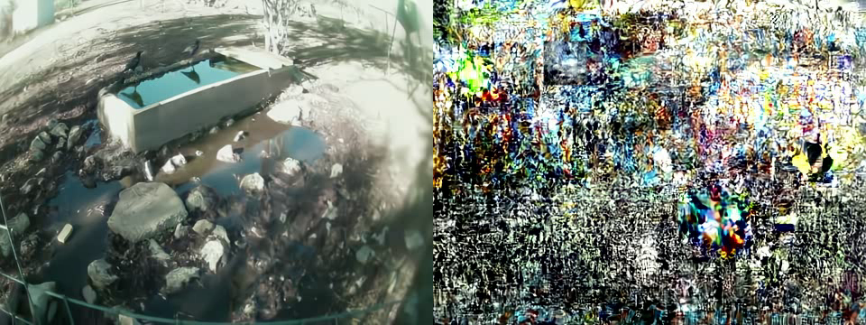

# FaunaCodec

ROI-aware dual-stream video compression for bandwidth-constrained wildlife camera traps.

Animals occupy a small fraction of a camera-trap frame. FaunaCodec detects the subject, then encodes the subject region and the background as **two independent streams**: the subject at high quality on a dense frame schedule, the background at low quality on a sparse one. The server decodes both, interpolates the frames the background stream dropped, and composites them back into a full-rate video.

Because the split lives outside the encoder, the same architecture runs on a learned neural codec (DCVC) and on H.264, HEVC, and AV1 through ffmpeg — one config key apart.

Code release for *"FaunaCodec: ROI-Aware Video Compression and Reconstruction for Wildlife Monitoring,"* ICTAI 2026.

```
Edge device                                    Server
───────────                                    ──────
raw video
  │
  ├─ MegaDetector V6 + KLT tracking
  ├─ motion-aware frame selection
  └─ dual-stream encode                        decode both streams
        ROI stream  subject, high quality  ──▶  AMT-interpolate dropped BG frames
        BG  stream  full frame, low quality,    composite ROI over background
                    heavily subsampled          RestoreUNet artifact removal  (optional)
        │                                       2x upscale                    (optional)
        └─────────── archive.zip ──────────▶    reconstructed video
```

---

## Install

Requires Python 3.10+, an NVIDIA GPU with CUDA, and ffmpeg on the `PATH` (`sudo apt install ffmpeg` on Debian/Ubuntu, `brew install ffmpeg` on macOS).

```bash
git clone https://github.com/imics-lab/FaunaCodec
cd FaunaCodec
bash setup.sh                  # creates ./.venv, installs PyTorch, builds DCVC's entropy coder
source .venv/bin/activate
```

`setup.sh` picks the PyTorch wheel matching your CUDA version; `--help` lists the options (`--cuda`, `--venv`, `--python`, `--no-venv`, `--extras`). To install into an environment you already manage, activate it and run `bash setup.sh --no-venv`, or do it by hand:

```bash
pip install torch torchvision --index-url https://download.pytorch.org/whl/cu124
pip install -e ".[metrics]"
pip install --no-build-isolation ./third_party/dcvc/src/cpp  # the rANS entropy coder
```

Then fetch the weights. They are grouped, so an edge device need not download the server-side models:

```bash
python scripts/download_models.py --list                  # what is available
python scripts/download_models.py --group compress        # edge: detector + DCVC  (~420 MB)
python scripts/download_models.py --group decompress      # server: DCVC + AMT     (~330 MB)
python scripts/download_models.py --group restore         # optional RestoreUNet   (~1.5 GB)
python scripts/download_models.py                         # everything
```

Every file is verified against the SHA-256 in `models/models.manifest.json` before and after download, so re-running is cheap and a truncated transfer is caught.

---

## Quickstart

A 21-second 720p clip ships in `data/bird1.mp4`.

```bash
# Whole pipeline: compress -> decompress -> restore -> upscale
faunacodec-pipeline data/bird1.mp4

# Just the codec, keeping every intermediate
faunacodec-pipeline data/bird1.mp4 --stages compress decompress --save-intermediate
```

Or drive the two halves separately, as a real deployment would:

```bash
# On the edge device
faunacodec-compress data/bird1.mp4 --resolution 640x360 -o bird1.zip

# On the server
faunacodec-decompress bird1.zip -o bird1_reconstructed.mp4
faunacodec-restore    bird1_reconstructed.mp4 -o bird1_restored.mp4
faunacodec-upscale    bird1_restored.mp4 --backend bicubic -o bird1_2x.mp4
```

Every command takes `-c/--config` and `-v/--verbose`; `--help` lists the rest. They are console entry points installed with the package, so each one also runs as a module, which is handy when the entry points are not on the `PATH`: `python -m faunacodec.cli.pipeline data/bird1.mp4`.

`notebooks/pipeline_demo.ipynb` walks through the same stages one at a time, showing what each produces.

### What to expect

On `data/bird1.mp4` (627 frames, downscaled to 640x360), the executed demo produces:

| Stage | Result |
|---|---|
| compress | 0.14 MB DCVC archive |
| decompress | 627 frames reconstructed at 640x360 |
| upscale (bicubic) | 1280x720 |

Two compression ratios, because they answer different questions:

| Against | Size | Ratio |
|---|---|---|
| the camera's own 720p H.264 recording | 17.05 MB | **125x** |
| the 640x360 working copy the encoder sees | 5.76 MB | **42x** |

The first is what a deployment saves on the uplink, but part of it is the downscale rather than the codec; the second isolates the codec. Most of either ratio comes from spending almost no bits on the background.

Quality follows the split: the subject region is **+4.76 dB PSNR** better than the same region decoded without the ROI stream composited over it (measured on this clip; `tests/test_end_to_end.py` asserts it stays above +1 dB).

For a fair block-codec comparison, the default codec-specific CRFs were calibrated on
the same clip to approximately equal reconstruction quality:

| Codec | ROI / background CRF | Overall PSNR | Subject PSNR | Archive size |
|---|---:|---:|---:|---:|
| H.264 | 19 / 30 | 30.26 dB | 31.62 dB | 175,365 bytes |
| HEVC | 22 / 32 | 30.20 dB | 31.85 dB | 172,276 bytes |
| AV1 | 32 / 62 | 30.60 dB | 31.45 dB | 106,179 bytes |

These are operating points for this sample, not universal CRF equivalences. Use
`scripts/dgx_codec_regression.py` on the target corpus before drawing broader
rate-distortion conclusions.

---

## The cross-architecture trap

**DCVC's floating-point entropy coder is not bit-exact across CPU architectures.** An archive encoded on an ARM edge device and decoded on an x86 server produces this, with no error raised at any point:



*Left: decoded on the ARM machine that encoded it. Right: the same bitstream decoded on x86. Mean PSNR between them is 12.3 dB.*

The divergence starts at encode time: the same clip and config produced a 90,769-byte archive on x86 and a 95,043-byte one on ARM.

FaunaCodec records the encoding machine's architecture in every archive and warns you at decode time when they differ. Your options:

- **Deterministic integer runtime** — `third_party/dcvc_int16/` runs DCVC with integer-quantized inference, making encode and decode bit-exact across machines. This is what the paper's deployed system uses. See [`third_party/dcvc_int16/README.md`](third_party/dcvc_int16/README.md).
- **A block codec** — set `compression.codec` to `h264`, `hevc`, or `av1`. These are unaffected, and the dual-stream split works identically.
- **Same architecture on both ends** — fine if that is your deployment.

---

## How it works

**Detection.** MegaDetector V6 (`MDV6-yolov9-c`) runs every 15th frame; KLT optical flow propagates boxes through the gaps. `faunacodec/detection/`

**Frame selection.** A motion state machine decides, per frame, whether the subject is moving. The two streams then keep frames on independent schedules: the ROI stream every 2nd frame while there is motion and every 3rd while there is not, the background stream every 6th frame, or every 10th when nothing is happening. `faunacodec/selection/`

**Dual-stream encode.** The ROI stream carries the frame with everything outside the detection boxes zeroed; the background stream carries the full frame at low quality. Both go through the same codec backend. `faunacodec/compression/`

**Archive.** A ZIP holding both bitstreams, the per-frame boxes, the frame schedules, and the resolved config. It is the entire edge/server interface. `faunacodec/archive.py`

**Reconstruction.** Both streams are decoded, the background's dropped frames are filled in by AMT interpolation, and the ROI is alpha-composited over the background using the stored boxes. `faunacodec/decompression/`

**Restoration and upscaling (optional).** RestoreUNet removes coding artifacts; an upscaling backend delivers 2x. `faunacodec/restoration/`, `faunacodec/upscaling/`

> Full-reference metrics (PSNR, VMAF) and no-reference metrics (NIQE, CLIP-IQA, MANIQA) rank the generative upscalers in **opposite orders**. An upscaled frame is a perceptual aid, not photometric evidence: a generative model synthesizes plausible detail, and can invent markings a viewer would read as a diagnostic cue. Keep it optional and say so downstream.

---

## Configuration

Everything is YAML in `configs/`. Nothing that affects output is hardcoded.

| File | Controls |
|---|---|
| `compression.yaml` | Codec backend, quality levels, detection, frame selection |
| `decompression.yaml` | Decoding, AMT interpolation, compositing |
| `restoration.yaml` | RestoreUNet checkpoint, DDIM steps, tiling (`_T1`/`_T5` vary the temporal window) |
| `upscaling.yaml` | Backend choice and per-backend settings |
| `pipeline.yaml` | Which stage config each stage uses, input resolution, output paths |

`pipeline.yaml` composes the others: each stage section names a file, and any key set alongside `config:` overrides that file.

**Switching codec** is one key:

```yaml
compression:
  codec: av1            # dcvc | h264 | hevc | av1
```

DCVC uses a quantization parameter where *higher is better* (`roi_qp_i: 63`, `bg_qp_i: 25`); the ffmpeg backends use codec-specific CRF settings, where *lower is better*. Both are in `compression.quality`.

When the input is resized for encoding, the CLI runs detection on the original video and scales every box into the encoded coordinate space. This preserves small-animal detail without increasing the transmitted resolution. The two videos must have identical frame counts and frame rates; Python callers can provide the native recording with `detection_video_path`.

**Upscaling backends**, slowest last:

| Backend | What it does | Cost per 30 s clip |
|---|---|---|
| `bicubic` | Lanczos resampling, adds no detail | seconds |
| `s3diff` | Degradation-guided one-step diffusion | ~25 min |
| `osediff` | Distilled one-step diffusion; sharpest at a practical cost | ~3.5 h |
| `pid` | Pixel-space diffusion, densest synthesized texture | ~20 min |
| `wan`, `cogvideo` | Video-native, temporal window | ~1 day |

Those timings are the paper's server-side measurements and will differ on your hardware; the ordering will not.

`s3diff` clones its upstream repo and downloads its weights on first use. `pid` needs a checkpoint you supply. `wan` and `cogvideo` are supported but were too slow to evaluate at corpus scale, and are correspondingly less exercised than the rest.

---

## Python API

The CLIs are thin wrappers over four functions:

```python
import yaml
from faunacodec import stages

compression_cfg = yaml.safe_load(open("configs/compression.yaml"))
decompression_cfg = yaml.safe_load(open("configs/decompression.yaml"))

archive = stages.compress(                                        # -> bytes
    "working_640x360.mp4",
    compression_cfg,
    detection_video_path="data/bird1.mp4",
)
decoded = stages.decompress(archive, decompression_cfg)           # -> DecodedVideo
frames = stages.restore(decoded.frames, yaml.safe_load(open("configs/restoration.yaml")))
frames = stages.upscale(frames, "bicubic", {"out_w": 960, "out_h": 720})
```

`DecodedVideo` carries `frames`, `fps`, `width`, `height`, and the `detections` the encoder stored, so a downstream task can use the boxes without re-running the detector.

---

## Repository layout

```
faunacodec/            The package
  stages.py              compress / decompress / restore / upscale
  archive.py             The archive format, read and written in one place
  config.py              Config validation
  paths.py               Resolving config paths against the repository
  video_io.py            Video reading and writing
  cli/                   Command-line entry points
  detection/             MegaDetector V6 + KLT tracking
  selection/             Motion state machine and the dual frame schedule
  masking/               Boxes to pixel masks and alpha mattes
  compression/           Dual-stream encoders (DCVC, ffmpeg)
  decompression/         Decoders, AMT interpolation, compositing
  restoration/           RestoreUNet
  upscaling/             Upscaling backends
configs/               YAML, one file per stage
scripts/               download_models.py, sanity_check.py, eval_metrics.py
notebooks/             pipeline_demo.ipynb
data/                  bird1.mp4, the demo clip
models/                Weights and models.manifest.json
tests/                 pytest suite
training/, data_prep/  Retraining RestoreUNet from scratch
third_party/           Vendored and derived external code (own README)
```

---

## Development

```bash
pip install -e ".[dev]"
pytest                        # unit tests; the end-to-end test needs weights + a GPU
ruff check .
pre-commit install
```

`pre-commit` runs `ruff check` only. `ruff format` is intentionally not wired in: this code predates it, so enabling it would rewrite most files at once. Run `ruff format .` yourself if you want that, as its own commit.

`tests/test_end_to_end.py` runs the real codec on `data/bird1.mp4` and skips itself when the weights or a CUDA device are missing. Everything else runs on CPU in about two seconds.

`python scripts/sanity_check.py` verifies an installation without needing weights.

---

## Scope

This repository is the **working pipeline**: it compresses and reconstructs video, and its behavior on the bundled clip is covered by tests.

It is **not** a reproduction harness for the paper's tables. The drivers that produced the 20-clip corpus matrix and the in-stream ROI (`addroi`) baseline are not part of this release, so those numbers cannot be regenerated from this code. The evaluation corpus itself is available (`python scripts/download_models.py --group data`) for anyone who wants to build on it.

Two limitations are worth stating plainly:

- **The framework is bounded by the detector.** An undetected animal is compressed as background and cannot be recovered. Fast motion, low nocturnal contrast, and dense multi-subject scenes are where this bites. FaunaCodec warns when a clip yields no detections at all, but it cannot warn about the ones it missed.
- **The split does not win on rate.** In-stream ROI encoding, where the codec supports it, is usually as cheap or cheaper. The split's value is structural: it is codec-agnostic, it works with a neural codec that has no native ROI mode, and it lets the two streams run on independent frame schedules.

---

## License

Apache-2.0 — see [`LICENSE`](LICENSE).

**Note on non-commercial use:** the vendored AMT frame interpolator is CC BY-NC 4.0, and it sits on the default decompression path. As bundled, this distribution is therefore research/non-commercial only. `faunacodec-decompress --no-interpolate` avoids AMT entirely, at some cost in temporal smoothness. Full inventory in [`THIRD_PARTY_LICENSES.md`](THIRD_PARTY_LICENSES.md).

## Citation

```bibtex
@inproceedings{Sakevych_2026_FaunaCodec,
  author    = {Mykhailo Sakevych and Felix Mathew and Vangelis Metsis},
  title     = {{FaunaCodec}: {ROI}-Aware Video Compression and Reconstruction for
               Wildlife Monitoring},
  booktitle = {Proceedings of the IEEE International Conference on Tools with
               Artificial Intelligence (ICTAI)},
  year      = {2026},
}
```
